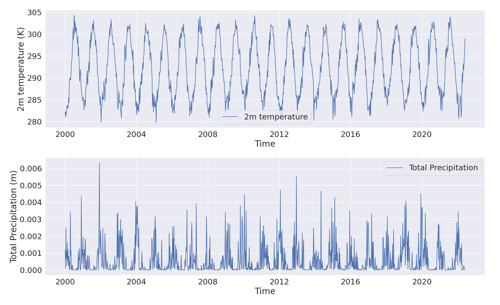
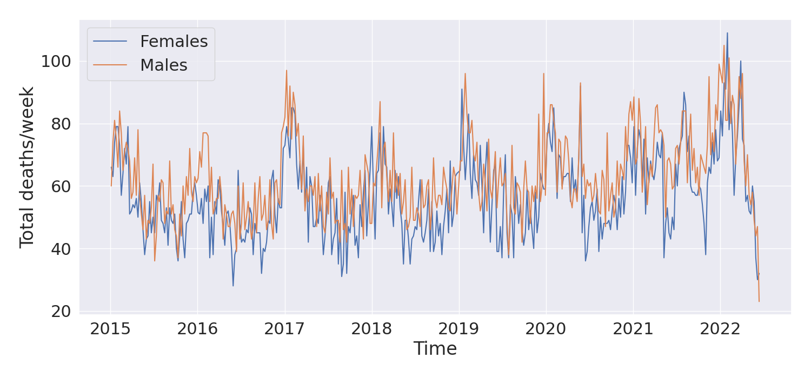

# EMME-ROCH project

Python code-base for the EMME-ROCH project, which downloads climate data from the Copernicus DataStore and Eurostat data.

## Installation

Clone the github repository `https://github.com/pantelisgeor/EMME_ROCH_python`, navigate to folder and install using the setup.py script.

```bash
git clone https://github.com/pantelisgeor/EMME_ROCH_python
cd EMME_ROCH_python
python setup.py install
```

**NOTE** The CDO operator is required for the spatial manipulation of gridded climate datasets. It can be installed through conda or `https://code.mpimet.mpg.de/projects/cdo/files`.

## Usage

### Downloading climate datasets

By default the EMME-ROCH downloads the ERA5-land dataset (`https://confluence.ecmwf.int/display/CKB/ERA5-Land%3A+data+documentation`) from the Copernicus DataStore for the EMME region (Eastern Meditteranean and Middle East) in monthly chunks.

To be able to retrieve datasets from the Copernicus DataStore (CDS), a valid user account is needed, which can be obtained free of charge from `https://cds.climate.copernicus.eu`.

The **downloadCDS()** function can be used to download a specified dataset from CDS for a specified month and year to a user specified directory (path_save) as follows:

```python
import emme_roch as er

er.downloadCDS(month, 
               year,
               path_save,
               days = range(1, 32),
               area = [43, 18, 33, 36],
               dataset = "reanalysis-era5-land",
               name_prefix = "ERA_land",
               variables = ["2m_dewpoint_temperature", "2m_temperature",
                            "forecast_albedo", "skin_reservoir_content",
                            "surface_sensible_heat_flux", "total_evaporation",
                            "total_precipitation"])
```

The days, area, dataset, name_prefix and variables arguments presented above are the default arguments and can be altered by the user to meet other needs. The name_prefix argument is used to construct the filename of the downloaded dataset, which is of the form **[name_prefix]\_yr_[year]\_mnth_[month].nc**.

In addition, the user can download all the data for a specified time period (determined by the start year/month and end year/month), to a specified directory (path_save), as in the following code block. Similarly to the previous example, the days, area, dataset, name_prefix and variables arguments used here are the defaults used in the package and can be ommitted.

```python
import emme_roch as er

er.downloadMultipleCDS(month_start, month_end, 
                       year_start, year_end, 
                       path_save,
                       days = range(1, 32),
                       area = [43, 18, 33, 36], 
                       dataset = "reanalysis-era5-land",
                       name_prefix = "ERA_land",
                       variables = ["2m_dewpoint_temperature", "2m_temperature",
                                    "forecast_albedo", "skin_reservoir_content",
                                    "surface_sensible_heat_flux", "total_evaporation",
                                    "total_precipitation"])
```

To keep the data up to date, the user can periodically use the ***completeDataset()*** function. Make sure to use the same parameters (area, dataset, name_prefix, variables) as the already downloaded datasets. The function checks the latest dataset present in the path_save directory, if incomplete (ie. there are missing days) it downloads it again to get the most recent version and completes the data up to the most recently available for the specified dataset. The *diff_threshold* parameter specifies the lag time of the dataset with respect to the current date in days (for the ERA5-land dataset is 2-3 months, so the default value here is 65 days).

```python
import emme_roch as er

er.completeDataset(path_save,
                   diff_threshold = 65,
                   name_prefix = "ERA_land",
                   area = [43, 18, 33, 36],
                   dataset = "reanalysis-era5-land",
                   variables = ["2m_dewpoint_temperature", "2m_temperature",
                                "forecast_albedo", "skin_reservoir_content",
                                "surface_sensible_heat_flux", "total_evaporation",
                                "total_precipitation"])
```

## Spatial and temporal averaging of climate data

Using the ***weekly_cdo()*** function, the user can combine multiple monthly datasets (with an hourly temporal resolution) and calculate the weekly average of the variables in the datasets (weekly temporal resolution starting on the first Monday of the combined dataset).

```python
import emme_roch as er

weekly_cdo(path_dat, name_prefix, path_out=None)
```

The *path_dat* variable defines the directory where the hourly netcdf datasets are stored and the *name_prefix* is the dataset identifier (eg. ERA_land for the default ERA5-land dataset used in this package). The function uses the system's CDO installation to combine the hourly datasets into a large netcdf containing all the datasets in the path_dat directory and then calculates the weekly averages (starting on the first Monday of the dataset) and the stores it in the same directory, unless the user defines the *path_out* variable, which is None by default.

In addition to the temporal averaging of the data, spatial avereges can also be performed to obtain area averaged on an administrative level, in this example the NUTS3 administrative level for Cyprus and Greece. The package requires the shapefile of the administrative level, which for this example was obtained through Eurostat (`https://ec.europa.eu/eurostat/web/gisco/geodata/reference-data/administrative-units-statistical-units/nuts`).

***NOTE:*** The EPSG:4326 coordinate reference system and the shapefile (SHP) format are required.  

```python
import emme_roch as er

# Read the NUTS3 administrative level shapefile (saved in data-local directory)
# nuts_level defines the admin level (NUTS3 in this case) and countries the countries for which
# to subset the shapefile for (in this example Cyprus and Greece)
nuts3 = er.readNuts(shapefile="data-local/NUTS_RG_20M_2021_4326.shp/NUTS_RG_20M_2021_4326.shp",
                    nuts_levels=[3], countries=["CY", "EL"])

# Create the weekly average of the downloaded netcdfs in a directory
er.weekly_cdo(path_dat="../data/", name_prefix="ERA_land", path_out="../weekly")

# Perform the NUTS3 admin level spatial averages
# Setting n_jobs=1 will calculate the spatial average for each NUTS3 level in the shapefile
# sequentially, whereas n_jobs>1 will use the multiprocessing module to perform parallel 
# operations. 
# NOTE: Parallel calculation is memory heavy
# NOTE: This step is performed in the weeklyEurostat function, there's no need to run it separately
df =  er.getNutsClimAll(path_nc="../weekly/ERA_land_20001_20225_weekly.nc", 
                        nuts_shp=nuts3, n_jobs=8)

# Eurostat data
# The Deaths by week, sex, 5-year age group and NUTS3 region (demo_r_mweek3) dataset 
# will be used as an example
df_weeklydeaths = er.weeklyEurostat(dataset="demo_r_mweek3", 
                                    path_nc="../weekly/ERA_land_20001_20225_weekly.nc",
                                    nuts_shp=nuts3)
```

In the graph below, the weekly averaged 2m temperature and total precipitation for the CY000 NUTS3 administrative level region (island of Cyprus) is presented.



In addition, the total deaths per week for Cyprus are shown below, for the time-period for which they are available on the Eurostat database (2015-2022).



As the above graphs, but for the EL301 NUTS3 administrative level region of Greece.


## Time Lagged Cross Correlation (TLCC)

The Time Lagged Cross Correlation matrix can be computed using the *TLCC()* function, for lag times between *start* and *end* (parameters of function which define the start and the end of the lag time window).

**PARAMETERS:**
df: Pandas dataframe which contains both the values of the variable 
    to investigate and the climatic variables

1. *nuts_id*: NUTS3 ID to perform the TLCC analysis
2. *age_group*: Age group to investigate
3. *start*: Lag times window start
4. *end*: Lag times window end
5. *plot*: Plot the time-series of the input variable
6. *plot_corrs*: Plot the TLCC graphs for all the climatic variables

```python
er.TLCC(df_weeklydeaths, nuts_id="CY000", age_group='TOTAL', plot_corrs=True, start=-40, end=41)
```


If the plot options are both set to False, the TLCC matrix is returned

```python
er.TLCC(df_weeklydeaths, nuts_id="CY000", age_group='TOTAL', start=-40, end=41)


         d2m       t2m    lai_hv       src       skt        sf       str        sp         e        tp  lag_time
0   0.010407 -0.015159 -0.203362  0.028186 -0.032241 -0.030274  0.098220  0.135623  0.159725  0.029189       -40
1  -0.000112 -0.030775 -0.197725  0.044781 -0.047906 -0.029115  0.114077  0.148413  0.154815  0.043098       -39
2  -0.007128 -0.037629 -0.195005  0.050397 -0.054806 -0.034866  0.117681  0.155442  0.150320  0.051043       -38
3  -0.013322 -0.045068 -0.193226  0.053501 -0.062162 -0.041319  0.122530  0.161008  0.147957  0.051695       -37
4  -0.030399 -0.062541 -0.184658  0.063692 -0.079241 -0.035068  0.131956  0.172850  0.137596  0.061896       -36
..       ...       ...       ...       ...       ...       ...       ...       ...       ...       ...       ...
76 -0.068158 -0.012837  0.190970 -0.066130 -0.000722 -0.004057 -0.125965 -0.043345 -0.238136 -0.058374        36
77 -0.061163 -0.006812  0.182840 -0.067894  0.005703  0.001127 -0.128690 -0.047679 -0.237280 -0.058944        37
78 -0.051565  0.002595  0.175729 -0.073880  0.014533 -0.008695 -0.133621 -0.047626 -0.233620 -0.060070        38
79 -0.033718  0.019920  0.156946 -0.082660  0.031462 -0.013058 -0.142287 -0.051275 -0.225172 -0.061709        39
80 -0.029740  0.027334  0.148413 -0.085886  0.038586 -0.011438 -0.149225 -0.057697 -0.225468 -0.061215        40
```

